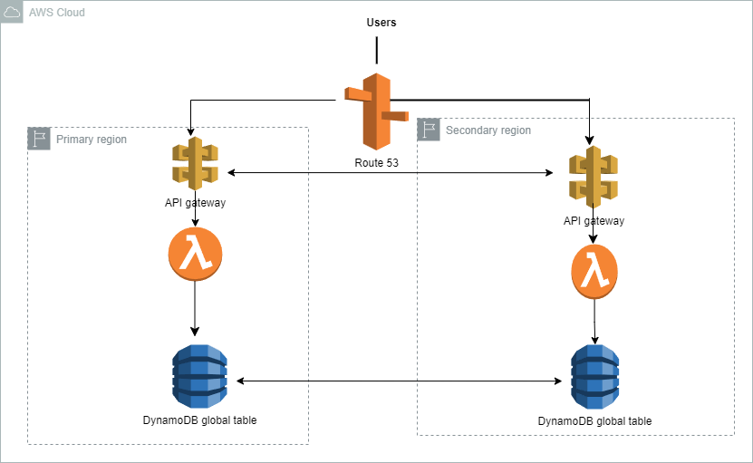

# **AWS Multi-Region Failover API (Terraform deployment)**

## **Table of Contents**
- [Project Purpose](#project-purpose)
- [Architecture Overview](#architecture-overview)
- [Features](#features)
- [Prerequisites](#prerequisites)
- [Deployment Instructions](#deployment-instructions)
- [Project Structure](#project-structure)
- [Usage](#usage)
- [Limitations](#limitations)
- [License](#license)
- [Contact](#Contact)

---

## **Project Purpose**

This project presents the case of a company which is providing weather data over a REST-based API to several customers. The API is hosted by Amazon API Gateway and is integrated with different AWS Lambda functions for each API operation. The company uses Amazon Route 53 for DNS and has created a resource record of `weather.example.com`. The company stores data for the API in Amazon DynamoDB tables. The company needs a solution that will give the API the ability to fail over to a different AWS Region. 

The team of solution architects has decided to:
- Deploy a new API Gateway API and Lambda functions in another Region.
- Change the Route 53 DNS record to a failover record. 
- Enable target health monitoring. Convert the DynamoDB tables to global tables. 

The goal pf this project is to realize this architecture and deploy it using terraform.

This project demonstrates the setup of a fault-tolerant, multi-region RESTful API system using AWS services. The architecture ensures high availability, disaster recovery, and seamless failover between regions. It is ideal for use cases requiring low-latency global access to weather data or other critical services.


---

## **Architecture Overview**





---
## **Features**

- **Multi-Region API Deployment:** Ensures high availability across AWS regions.
- **Failover Routing:** Uses Amazon Route 53 for health checks and automated failover.
- **DynamoDB Global Tables:** Seamless data replication across regions.
- **Serverless Design:** Leverages AWS Lambda for scalable and cost-effective compute

---
## **Prerequisites**

1. AWS account with permissions for the following services:
   - Amazon Route 53
   - AWS Lambda
   - Amazon API Gateway
   - Amazon DynamoDB
2. Terraform installed locally (v1.0 or higher).
3. AWS CLI configured with access keys.

---

## **Deployment instructions**

1.  **Clone the repository**
```bash
git clone https://github.com/narcissenjeufack/aws-failover-api.git
cd aws-failover-api
```

2. **Configure variables**

Update the `variables.tf` files in the root and modules with your desired values (e.g., regions, table names, domain name).

3. **Initialize terraform**

`terraform init`

4. **Plan and Apply the Configuration**

```bash
terraform plan
terraform apply
```

5.  **Verify the deployment**

- Check Route 53 failover records.
- Access the primary and secondary API endpoints.

---

## **Project structure**

```
my-project/
├── lambda/
│   ├── handler.py               # Lambda function code
│   ├── requirements.txt         # Python dependencies for Lambda
│   └── lambda.zip               # The zipped Lambda deployment package
├── modules/
│   ├── api/
│   │   ├── main.tf              # API Gateway and Lambda setup
│   │   ├── variables.tf         # Variables for API setup
│   │   ├── outputs.tf           # API outputs (e.g., endpoint URL)
│   │   └── lambda.zip           # Lambda deployment package (optional)
│   ├── dynamodb/
│   │   ├── main.tf              # DynamoDB table setup
│   │   ├── variables.tf         # Variables for DynamoDB
│   │   └── outputs.tf           # DynamoDB outputs
│   └── route53/
│       ├── main.tf              # Route 53 failover setup with health checks
│       ├── variables.tf         # Variables for Route 53 setup
│       └── outputs.tf           # Route 53 outputs
├── main.tf                      # Root configuration (calls modules)
├── variables.tf                 # Root variables (e.g., region names, table name)
├── outputs.tf                   # Root outputs (e.g., API URL, DynamoDB name)
└── terraform.tfvars             # Environment-specific variable values
```

---
## **Usage**

1. Make HTTP requests to the custom domain (e.g., `https://weather.example.com`).
2. Validate failover by simulating outages in the primary region.

---
## **Limitations** 

- Regional latency: Users far from both regions might experience higher latency.
- DynamoDB writes: Consistency may vary due to eventual replication delays.

---

## **License**

This project is licensed under the MIT License. See the LICENSE file for details.

---
## **Contact**

For issues or suggestions, please create a GitHub issue or contact me at njeufacknarcisse1@example.com.

